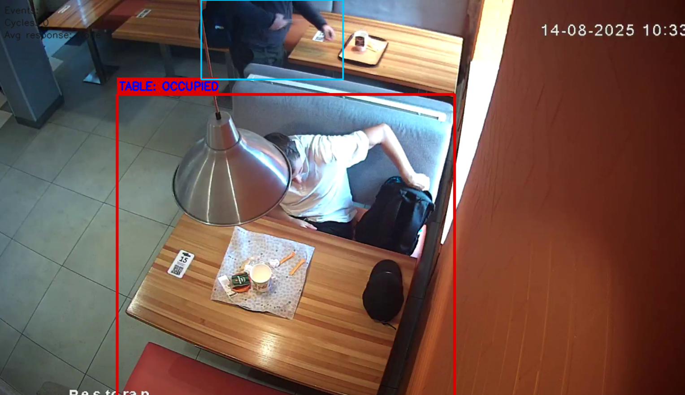

# Детекция уборки столиков по видео

## Запуск

```bash
pip install -r requirements.txt
python main.py --video video_2.mp4
```

Результат: размеченное видео сохраняется в каталог `output` (файл `output.mp4`). Если указанный файл не существует, скрипт попытается скачать демо-ролик по ссылке из `main.py`.

---

## Выбранные видео и столик

| Параметр | Значение |
|----------|----------|
| **Видео** | *`video_2.mp4`* |
| **Столик (ROI)** | Зона столика задаётся **интерактивно** при запуске: на первом кадре открывается окно `Select the table area`.|

---

## Логика детекции событий

1. **Детекция людей:** модель YOLO (`config.MODEL`, по умолчанию `yolov8n.pt`).
2. **Присутствие у столика:** для каждого бокса считается пересечение с ROI (IoU относительно площади ROI). Если IoU ≥ `IOU_THRESHOLD`, человек считается «в зоне столика».
3. **Ускорение:** инференс YOLO выполняется не на каждом кадре, а с шагом `SKIP_FRAMES`.
4. **Конечный автомат состояний** (`TableTracker`):
   - при появлении человека в зоне после **EMPTY** фиксируется **APPROACH**, затем **OCCUPIED**;
   - после ухода людей из зоны нужно `EMPTY_FRAMES_NEEDED` подряд кадров без человека в ROI — тогда состояние **EMPTY** и событие «столик свободен».
5. **Метрика «задержки»:** для каждого перехода в **EMPTY** ищется ближайший по времени следующий **APPROACH**; В интерфейсе и статистике показывается **среднее** по таким интервалам (`avg_response_sec`), число циклов — `n_cycles`.

---


## Пример проблемного кадра



Иногда модель не может найти человека.